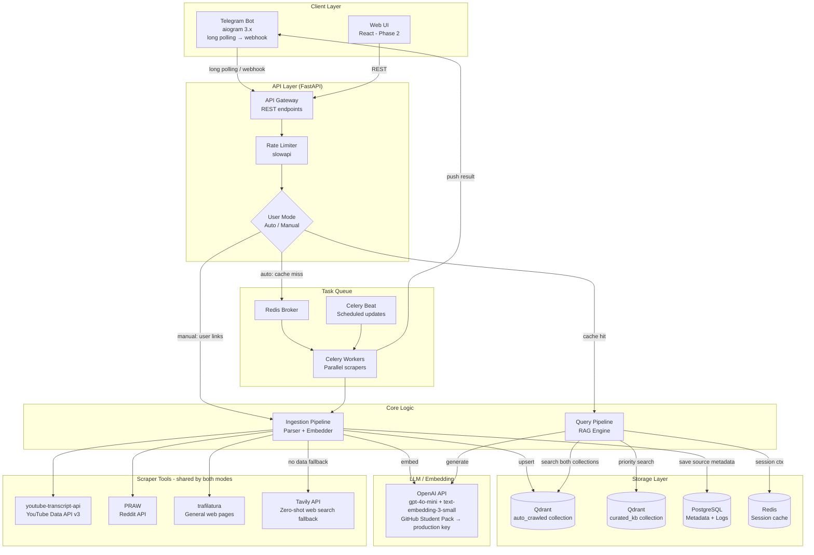
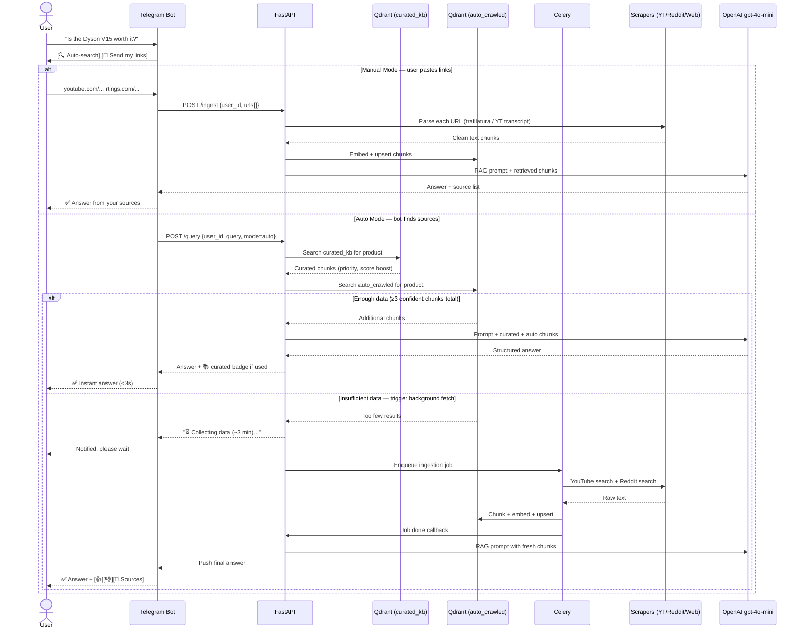
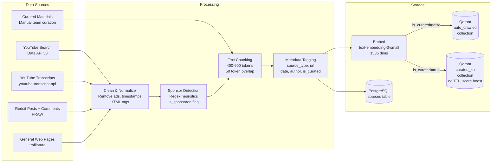
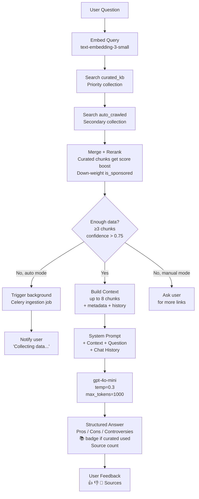
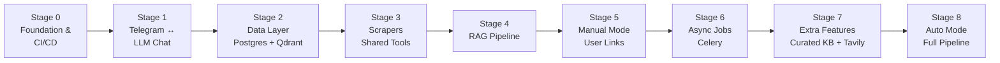

# ReviewMind 🔍

> **AI-powered pre-purchase research aggregator** — ask a product question, get a balanced analysis from dozens of YouTube reviews and Reddit discussions in seconds.

---

## The Problem

Before buying anything, people spend **hours** watching YouTube reviews and browsing Reddit — yet:
- Most videos are sponsored and biased
- Each new source adds only ~5% of new knowledge
- The one honest critical review gets buried under 50 positive ones
- Manually aggregating and weighing contradictory opinions is exhausting

## The Solution

ReviewMind automatically collects transcripts from YouTube and discussions from Reddit, stores them in a vector database, and answers your specific questions with a **balanced, source-cited analysis** — highlighting both mainstream praise and critical minority opinions.

Two modes of operation:
- **Auto mode** — give the bot a product name, it finds and fetches sources itself
- **Manual mode** — paste your own links (YouTube, Reddit, articles), the bot analyzes exactly what you provided

A **curated knowledge base** maintained by the team covers the most popular product categories out of the box, so common queries get instant answers without any scraping delay.

---

## Architecture Overview

### High-Level System



---

### Request Flow



---

### Data Ingestion Pipeline



---

### RAG Query Pipeline



---

## Tech Stack

| Layer | Technology | Why |
|---|---|---|
| **Bot** | aiogram 3.x | Best async Telegram library for Python |
| **API** | FastAPI + uvicorn | Async, fast, auto-docs |
| **Task Queue** | Celery + Redis | Durable background jobs, survive restarts, easy retry |
| **Vector DB** | Qdrant (self-hosted, 2 collections) | Purpose-built ANN, free, payload filters, score boost |
| **Relational DB** | PostgreSQL + asyncpg | Metadata, logs, source deduplication |
| **Cache / Broker** | Redis | Session context (30min TTL) + Celery broker |
| **Embeddings** | OpenAI text-embedding-3-small | $0.02/1M tokens, multilingual, no GPU needed |
| **LLM** | gpt-4o-mini via OpenAI API | Best price/quality for synthesis; GitHub Student Pack for dev |
| **YouTube** | youtube-transcript-api + YouTube Data API v3 | Official + free transcript extraction |
| **Reddit** | PRAW (official API) | Rate-limit safe, stable |
| **Web scraping** | trafilatura | Extracts clean article text from any URL, no headless browser |
| **Web search fallback** | Tavily API (free tier: 1000 req/month) | LLM-ready results, zero-shot answers when DB is empty |
| **Containers** | Docker + Docker Compose | Isolation, reproducibility, arm64 + amd64 compatible |
| **CI/CD** | GitHub Actions | Auto test + build + deploy on push |
| **Proxy** | Nginx + Let's Encrypt | TLS termination (required for webhook, Phase 2+) |

> **API key strategy:** use GitHub Student Developer Pack (free GPT-4o mini access) during development. Switch `OPENAI_API_KEY` and `OPENAI_BASE_URL` to production OpenAI credentials before launch — zero code changes required as both use the same OpenAI-compatible REST interface.

---

## Project Structure
### WIP

---

## Deployment

### Prerequisites
- Docker + Docker Compose
- Domain name (for HTTPS webhook)
- OpenAI API key
- YouTube Data API v3 key
- Reddit app credentials (from reddit.com/prefs/apps)
- Telegram Bot token (from @BotFather)

### Quick Start

```bash
# TO-DO
```

### Environment Variables

```env
# TO-DO
```

---

## Development Roadmap

The project is built sequentially in clearly isolated stages. Each stage has defined acceptance criteria — **nothing moves forward until the current stage is verified end-to-end**. This allows confident incremental progress and easy debugging since only one new system is introduced at a time.



---

## Cost Estimate (MVP)

| Resource | Cost/month |
|---|---|
| VPS (private proxmox xeon2696v4) | Priceless |
| OpenAI API (500 users, ~20 queries/user) | ~$15–30 |
| YouTube Data API v3 | Free (10K quota/day) |
| Reddit PRAW | Free |
| Qdrant (self-hosted) | Free |
| **Total** | **~$15–30/month** |

> **Embedding cost breakdown:** 500 users × 20 queries × ~1000 tokens = 10M tokens/month → **$0.20** (text-embedding-3-small). The dominant cost is LLM generation, not embeddings — no need to self-host.

---

## Key Design Decisions

**Why two Qdrant collections instead of one?**
`curated_kb` and `auto_crawled` have fundamentally different lifecycles and trust levels. Curated content is permanent, manually vetted, and gets a score boost in retrieval. Auto-crawled content can be stale, biased, or sparse. Keeping them separate lets us boost curated results without touching the retrieval algorithm, and lets us wipe/rebuild `auto_crawled` without affecting the trusted baseline.

**Why scrapers are built before the bot modes?**
Scrapers (Stage 3) are the shared foundation used identically by both manual mode (Stage 5) and auto mode (Stage 8). Building them once as clean, independently testable modules avoids duplication and means Stage 8 is mostly orchestration, not new scraping logic.

**Why manual mode before auto mode?**
Manual mode is simpler (no topic extraction, no search API calls), proves the full RAG pipeline end-to-end, and gives you a working product earlier. Auto mode is just adding an automated source-discovery step before the same pipeline.

**Why Qdrant over MongoDB Atlas Vector Search?**
Qdrant is purpose-built for vector search with native payload filtering, significantly lower latency for ANN queries, and is completely free when self-hosted. For a system where vector search is the *core* operation, it's the right tool. PostgreSQL handles relational bookkeeping.

**Why gpt-4o-mini over o4-mini (reasoning model)?**
Reasoning models solve multi-step logical problems. Your task is text synthesis and summarization — gpt-4o-mini follows complex structured prompts reliably at ~10x lower cost.

**Why long polling first, webhook later?**
Long polling requires zero infrastructure (no domain, no HTTPS, no Nginx). Webhook requires all of that. For development and early testing, long polling gets you running immediately. Switch to webhook only when the web UI requires HTTPS anyway.

**Why Celery + Redis over FastAPI BackgroundTasks?**
FastAPI BackgroundTasks run in-process and don't survive a restart. Celery tasks are durable, retryable, monitorable via Flower, and scale horizontally — critical when scraping jobs take 3–5 minutes.

**Why GitHub Student Pack API for dev, then swap to production OpenAI?**
Both use the same OpenAI-compatible REST API. Only `OPENAI_API_KEY` and `OPENAI_BASE_URL` differ. Free dev credits → zero cost while building. One `.env` change to go production.

---